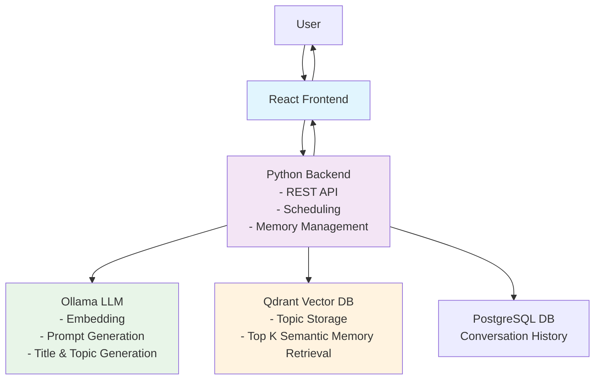

# Valac

**Self-hosted AI with intelligent memory management**

Valac is a solo-developed personal AI assistant focused on offline, memory-augmented interactions. It builds a persistent memory of your interactions, creating increasingly personalized responses over time.

**Key Features:**

- Semantic memory via **vector embeddings** and **similarity search**
- Verbatim conversation memory via Postgres
- Local-first LLM orchestration with **no cloud dependencies**
- Thoughtful architecture for **future agent-like functionality**
- **Built with**: Python, TypeScript, React, Qdrant, PostgreSQL, Ollama

Valac stores and categorizes every interaction, then uses related memories from your history to provide more contextual, personalized responses as your conversation history grows.

## Current Status: Functional with memories across conversation boundaries with visualizations for topics

## ✅ Phase 1: Proof of Concept

Goal: A self-contained, local system that runs end-to-end.

- [x] React + Vite frontend sends user input to backend
- [x] Node.js backend with `/ask` endpoint
- [x] Ollama LLM (e.g., Mistral) running locally
- [x] Generate embeddings from user prompts
- [x] Store and query vector data using Qdrant (previously Chroma)
- [x] Inject relevant memory into prompt to LLM
- [x] Return LLM response to user
- [x] Persist assistant responses to memory
- [x] Enforce minimum similarity (distance threshold) on memory query results

---

## 🔜 Phase 2: Memory Management

Goal: Display memories as conversations and topics/tags and allow

- [x] Add time to memories
- [x] Streaming response in UI
- [x] Show UI indication of memory updates
- [x] Add tags/topics to memories
- [x] Track conversation/session IDs
- [x] Port backend to Python
- [ ] Personalization memories
  - [ ] Detect and store
  - [ ] Display as gold nodes in graph view
- [ ] Allow ability for user to spawn multiple threads based from the same conversation. (Do we need this when Valac has cross-conversation memory?)
- [ ] Memory summarization?
- [ ] Add topic viewer to UI
  - [x] Initial graph visualization
  - [ ] Highlight tags connected to current conversation
  - [ ] Allow separate graphs for user vs. general memories
- [ ] Manual tag editing?
- [ ] Memory deletion from UI
  - [x] Complete memory wipe
  - [ ] Delete tag
  - [ ] Delete conversation
- [ ] Memory locks in UI - User marks a memory/topic/conversation as permanent and not a candidate for deletion and/or summarization
- [ ] DB size limit control in UI

---

## 🔜 Phase 3: Agency and Autonomous Behavior

Goal: Agency and passive memory management

- [x] Add automatic web search functionality
- [ ] Enable Valac to trim its own memory autonomously - consider memory importance based on frequency of access & relation to other topics
- [ ] Integrate LangChain plugins
- [ ] User selectable LLM models for both the core LLM (used for prompt generation) and auxiliary LLM (used for tag generation)

---

## 🎯 Phase 4: Hosting, Deployment, and UX Polish

Goal: Cloud-based deployment for quick demonstrations

- [ ] Reconfigure for AWS
- [ ] Add authentication, rate limiting, logging
- [ ] Improve error handling and user feedback

## Design Philosophy

Valac explores what a personal, local-first AI assistant could look like — one with long-term memory, contextual awareness, and plugin-based actions. The project is designed with future capabilities in mind:

- Conversational memory that evolves over time
- Plugin system enabling agentic behaviors ("call a taxi", "remind me", "search the web")
- LoRA-ready architecture for eventual fine-tuning
