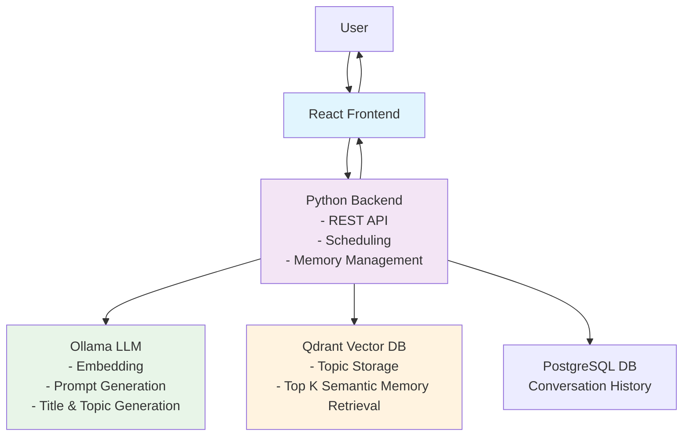
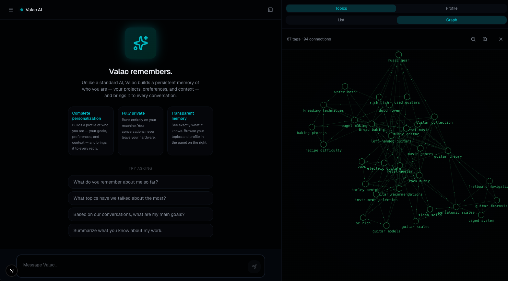

# Valac

**Self-hosted AI with intelligent memory management**

Valac is a solo-developed personal AI assistant focused on offline, memory-augmented interactions. It builds a persistent memory of your interactions, creating increasingly personalized responses over time.

**Key Features:**

- Semantic memory via **vector embeddings** and **similarity search**
- Verbatim conversation memory via Postgres
- Local-first LLM orchestration with **no cloud dependencies**
- Thoughtful architecture for **future agent-like functionality**
- **Built with**: Python, TypeScript, React, Qdrant, PostgreSQL, Ollama

Valac stores and categorizes every interaction, then uses related memories from your history to provide more contextual, personalized responses as your conversation history grows.





---

## Installation

### Prerequisites

- [Docker](https://www.docker.com/get-started) and Docker Compose
- [Ollama](https://ollama.com) installed and running on your host machine

Valac runs Ollama on your host (not inside Docker) for faster inference. Make sure Ollama is running before starting the stack.

### 1. Pull the required models

Valac needs two models: one for chat and one for embeddings.

```bash
ollama pull qwen3:8b
ollama pull nomic-embed-text
```

### 2. Configure environment

Create a `.env` file in the project root:

```bash
# On macOS or Windows (Docker Desktop)
OLLAMA_HOST=http://host.docker.internal:11434

# On Linux (host networking)
OLLAMA_HOST=http://172.17.0.1:11434
```

`host.docker.internal` lets the backend container reach Ollama running on your machine. Linux users may need to use the Docker bridge IP instead — run `ip addr show docker0` to confirm it.

### 3. Start the stack

```bash
docker compose up --build
```

This starts:

| Service              | URL                   |
| -------------------- | --------------------- |
| Valac UI             | http://localhost:3000 |
| Python backend       | http://localhost:8000 |
| SearXNG (web search) | http://localhost:8080 |
| Qdrant (vector DB)   | http://localhost:6333 |
| PostgreSQL           | localhost:5432        |

First startup takes a few minutes while Docker builds the images. Subsequent starts are fast.

### 4. Open Valac

Navigate to [http://localhost:3000](http://localhost:3000). Start chatting — memory accumulates automatically as you use it. The panel on the right shows your topics and profile as they build up.

---

### Resetting all data

The UI has a **Wipe DB** button in the conversation sidebar that clears all messages, memory, and topics. This cannot be undone.

---

### Switching to a different model

Change `OLLAMA_MODEL` in your `.env` and restart the backend:

```bash
OLLAMA_MODEL=llama3.2
```

Any model available in your local Ollama installation will work. Larger models give better memory extraction and reasoning at the cost of speed.

---

### Running Ollama inside Docker (optional)

By default Ollama runs on your host for speed. If you prefer a fully containerized setup, uncomment the `ollama` service in `docker-compose.yml` and update `OLLAMA_HOST` in your `.env`:

```bash
OLLAMA_HOST=http://ollama:11434
```

Note: containerized Ollama is significantly slower without GPU passthrough configured.

---

## Current Status: Functional with memories across conversation boundaries with visualizations for topics and personal data

**Known Issues**

- Post-response processing can overwhelm the LLM and cause failed writes — need to use a lighter model for smaller processes like topic updates; will push post-response tasks to workers through a durable queue like Redis with Celery.
- Chokes on embedding when given long code snippets

## ✅ Phase 1: Proof of Concept

Goal: A self-contained, local system that runs end-to-end.

- [x] React + Vite frontend sends user input to backend
- [x] Node.js backend with `/ask` endpoint
- [x] Ollama LLM (e.g., Mistral) running locally
- [x] Generate embeddings from user prompts
- [x] Store and query vector data using Qdrant (previously Chroma)
- [x] Inject relevant memory into prompt to LLM
- [x] Return LLM response to user
- [x] Persist assistant responses to memory
- [x] Enforce minimum similarity (distance threshold) on memory query results

---

## Phase 2: Memory Management

Goal: Display memories as conversations and topics/tags and allow editing

- [x] Add time to memories
- [x] Streaming response in UI
- [x] Show UI indication of memory updates
- [x] Add tags/topics to memories
- [x] Track conversation/session IDs
- [x] Port backend to Python
- [x] Personalization memories
  - [x] Detect and store
  - [x] Display as gold nodes in graph view
- [ ] Allow ability for user to spawn multiple threads off of the same conversation. (Do we need this when Valac has cross-conversation memory?)
- [ ] Memory summarization
- [ ] Add topic viewer to UI
  - [x] Initial graph visualization
  - [ ] Highlight tags connected to current conversation
  - [x] Allow separate graphs for user vs. general memories
- [ ] Manual tag editing?
- [ ] Memory deletion from UI
  - [x] Complete memory wipe
  - [ ] Delete tag
  - [ ] Delete conversation
- [ ] Memory locks in UI - User marks a memory/topic/conversation as permanent and not a candidate for deletion and/or summarization
- [ ] DB size limit control in UI
- [x] Add automatic web search functionality
- [ ] Display web links for sources
- [ ] Durable post-response worker queue

---

## Phase 3: Agency and Autonomous Behavior

Goal: Agency and passive memory management

- [ ] Investigate MCP
- [ ] Enable Valac to trim its own memory autonomously
- [ ] Integrate LangChain plugins
- [ ] User selectable LLM models for core and auxiliary tasks

---

## Phase 4: Hosting, Deployment, and UX Polish

Goal: Cloud-based deployment for quick demonstrations

- [ ] Reconfigure for AWS
- [ ] Add authentication, rate limiting, logging
- [ ] Improve error handling and user feedback

## Unscheduled features

- [ ] RAG pipeline to allow for full document drops

## Design Philosophy

Valac explores what a personal, local-first AI assistant could look like — one with long-term memory, contextual awareness, and plugin-based actions. The project is designed with future capabilities in mind:

- Conversational memory that evolves over time
- Plugin system enabling agentic behaviors ("call a taxi", "remind me", "search the web")
