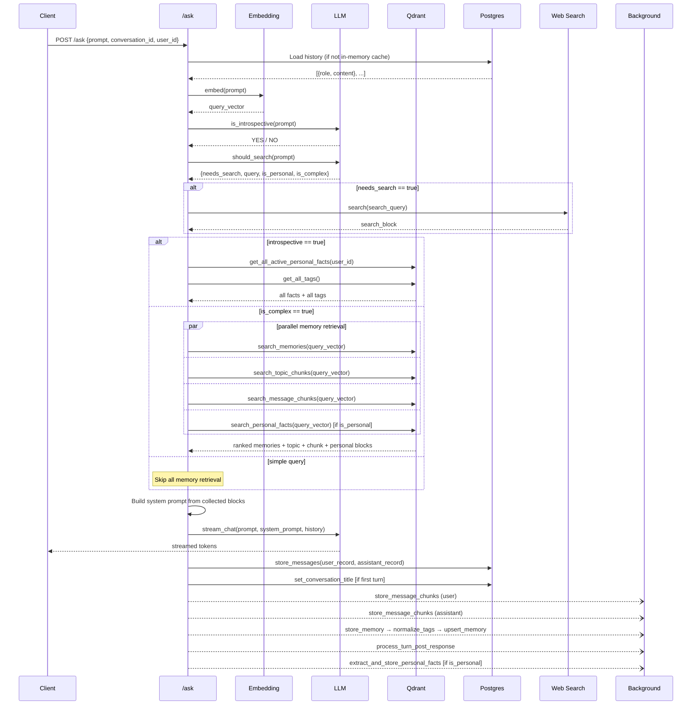

```mermaid
sequenceDiagram
    participant C as Client
    participant A as /ask
    participant E as Embedding
    participant L as LLM
    participant Q as Qdrant
    participant P as Postgres
    participant W as Web Search
    participant BG as Background

    C->>A: POST /ask {prompt, conversation_id, user_id}
    A->>P: Load history (if not in-memory cache)
    P-->>A: [{role, content}, ...]

    A->>E: embed(prompt)
    E-->>A: query_vector

    A->>L: is_introspective(prompt)
    L-->>A: YES / NO

    A->>L: should_search(prompt)
    L-->>A: {needs_search, query, is_personal, is_complex}

    alt needs_search == true
        A->>W: search(search_query)
        W-->>A: search_block
    end

    alt introspective == true
        A->>Q: get_all_active_personal_facts(user_id)
        A->>Q: get_all_tags()
        Q-->>A: all facts + all tags
    else is_complex == true
        par parallel memory retrieval
            A->>Q: search_memories(query_vector)
        and
            A->>Q: search_topic_chunks(query_vector)
        and
            A->>Q: search_message_chunks(query_vector)
        and
            A->>Q: search_personal_facts(query_vector) [if is_personal]
        end
        Q-->>A: ranked memories + topic + chunk + personal blocks
    else simple query
        Note over A: Skip all memory retrieval
    end

    A->>A: Build system prompt from collected blocks

    A->>L: stream_chat(prompt, system_prompt, history)
    L-->>C: streamed tokens

    A->>P: store_messages(user_record, assistant_record)
    A->>P: set_conversation_title [if first turn]

    A--)BG: store_message_chunks (user)
    A--)BG: store_message_chunks (assistant)
    A--)BG: store_memory → normalize_tags → upsert_memory
    A--)BG: process_turn_post_response
    A--)BG: extract_and_store_personal_facts [if is_personal]
```
